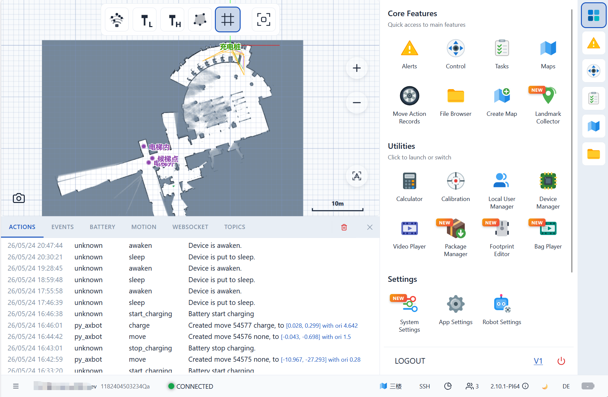

# axbot-ts-sdk

TypeScript SDK for controlling [Autoxing](https://github.com/AutoxingTech) AMRs via REST and WebSocket APIs.

This SDK powers the robot monitoring platform [rb-admin.autoxing.com](https://rb-admin.autoxing.com). The SDK and the platform are developed in tandem — API additions, protocol changes, and new capabilities are implemented in the SDK first and consumed by the platform immediately.



## Installation

```bash
npm install @kingsimba/axbot-sdk
```

## Modules

The SDK is split into sub-path exports — import only what you need:

| Import path                             | Contents                                                          |
| --------------------------------------- | ----------------------------------------------------------------- |
| `@kingsimba/axbot-sdk/robotApi`         | REST API client (`RobotApi`) and all request/response types       |
| `@kingsimba/axbot-sdk/ws`               | WebSocket client (`WsClient`), `WsEventEmitter`, `WsMessageStore` |
| `@kingsimba/axbot-sdk/objectStore`      | Reactive data stores (`ObjectStore`, `ArrayObjectStore`)          |
| `@kingsimba/axbot-sdk/msgs`             | Topic message type definitions                                    |
| `@kingsimba/axbot-sdk/decoder`          | Binary WebSocket frame decoder                                    |
| `@kingsimba/axbot-sdk/mapInfo`          | Map info utilities                                                |
| `@kingsimba/axbot-sdk/pointCloudParser` | Point cloud data parser                                           |
| `@kingsimba/axbot-sdk/pbMessages`       | Protobuf message helpers                                          |
| `@kingsimba/axbot-sdk/geojson`          | GeoJSON type helpers                                              |
| `@kingsimba/axbot-sdk/utils`            | General utilities                                                 |
| `@kingsimba/axbot-sdk/proto`            | Compiled protobuf definitions                                     |

## Usage

### REST API

```ts
import { robotApi } from '@kingsimba/axbot-sdk/robotApi';

// Initialize once with a config
robotApi.init({
  getApiBase: () => '/robot_api/v1/MY_ROBOT_SN',
});

// Call typed REST methods
const maps = await robotApi.getMaps();
await robotApi.wakeDevice();
await robotApi.setControlMode('remote');
await robotApi.setEmergencyStop(false);
```

### WebSocket

```ts
import { wsClient } from '@kingsimba/axbot-sdk/ws';
import { WsEventEmitter } from '@kingsimba/axbot-sdk/ws';

// Connect
wsClient.connect('ws://192.168.x.x:8090/ws/v2/topics');

// Subscribe to a topic (event-based, no cache)
const emitter = new WsEventEmitter<MyMsgType>('/chassis/odom');
const unsubscribe = emitter.subscribe((msg) => {
  console.log(msg);
});

// Unsubscribe when done
unsubscribe();
```

### Reactive Object Store

```ts
import { MapListStore } from '@kingsimba/axbot-sdk/objectStore';

const unsubscribe = MapListStore.subscribe((maps) => {
  console.log('maps updated', maps);
});

await MapListStore.refresh(); // fetches from robot and notifies subscribers
```

## Building from source

```bash
pnpm install
pnpm build
```

## Protobuf definitions

The `.proto` files under `src/proto/` are mirrored from the robot's `ax_msgs` ROS package, which is the single source of truth, and `generated.js` +
`generated.d.ts` are committed alongside them. `pnpm proto` mirrors the upstream
tree and recompiles in one step, so the compile never runs against a stale copy:

```bash
pnpm proto                    # mirror the sources, then recompile
pnpm proto --from <dir>       # read the protos from another checkout
pnpm proto --check            # report drift only; exits 1, writes nothing
```

The protos are read from `$AXBOT_PROTO_SRC` when set, otherwise from the default
local checkout; `--from <dir>` overrides both. Run it from this package or from
the workspace root.

`--check` compares both the mirrored sources and the committed `generated.*`
against upstream and exits non-zero on any difference, so it can gate CI. If a
proto was removed upstream, the local copy is reported as `unknown` and left in
place rather than deleted — remove it by hand once you have confirmed it is gone.
When the source directory is unavailable, `pnpm proto` warns and compiles the
local copy as-is; `--check` and an explicit `--from` still fail.

## Demo

An interactive browser-based demo is available in the sibling [`axbot-ts-sdk-demo`](https://github.com/AutoxingTech/axbot-ts-sdk-demo) package.

## License

[MIT](LICENSE) — Copyright (c) 2026 Autoxing Technology
